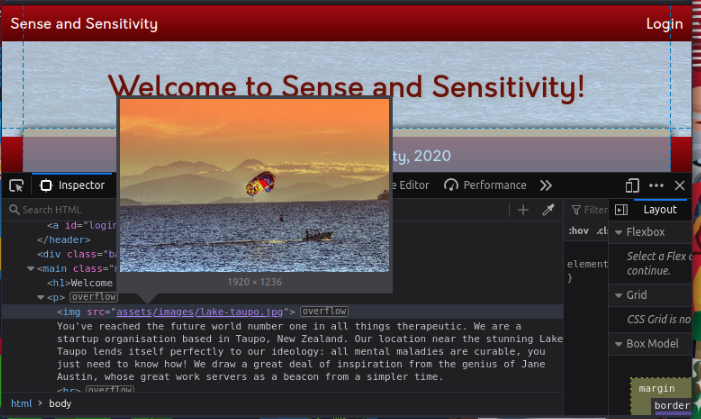
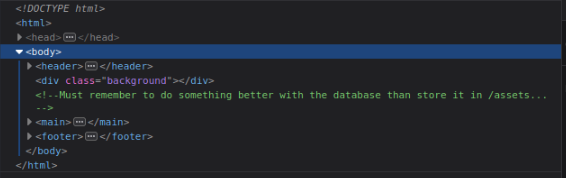

<h1 align="center">OWASP top 10 2021 - By Cr4Sh</h1>

---

> Pour rejoindre [TryHackMe](https://tryhackme.com/signup?referrer=63efffa0f0738c004b13a210 "Apprenez la cybersécurité avec Try Hack Me")

***Contexte*** :

  > L'OWASP (Open Web Application Security) est une communauté ouverte. Son objectif est de permettre de développer, acheter et maintenir des application et APIS qui sont fiables. [OWASP](https://owasp.org/Top10/A00-about-owasp/)
  >
  > L'OWASP top 10 est l'un des projets les plus connus de l'OWASP. Elle recense les 10 vulnérabilités les plus critiques.

****
<a name="room"></a>

> Room : [Try Hack Me - Owasp Top 10 2021](https://tryhackme.com/room/owasptop102021)

***Top 10 Vulnérabilités - 2021***

1. [Broken Access Control](#broken)
2. [Cryptographic Failures](#crypto)
3. [Injection](#injection)
4. [Insecure Design](#insecure)
5. [Security Misconfiguration](#misconf)
6. [Vulnerable and Outdated Components](#vulComponent)
7. [Identification and Authentications Failures](#authFailure)
8. [Software and Data Integrity Failures](#dataIntegrity)
9. [Security Logging & Monitoring Failures](#securityLogging)
10. [Server-Side Request Forgery (SSRF)](#ssrf)


  > L'objectif, dans ce walktrough est de vous guider et vous montrer une manière de faire. Vous aurez souvent plusieurs possibilités pour arriver au même résultat. 
  >
  > ***Notes:*** *Les titres des vulnérabilités est volontairement écrits en anglais afin de pouvoir être au plus proche des dénominations de l'OWASP et ne pas risquer une déformation lors de la traduction.*
  > De même afin de ne pas spoiler celles et ceux d'entre vous qui souhaiteraient essayer de trouver les réponses par eux même (ce que je vous encourage fortement) les réponses potentiellement évoquées dans le texte seront nommées sous la mention ``[redacted]``


****

**[TASK 1] - Introduction**

***Q1 : Lire le contenu : Aucune réponse***

---

**[TASK 2] - Accessing Machines**

***Q1 : Se connecter au réseau via votre openVPN ou votre AttackBox : Aucune réponse***

---
<a name="broken"></a>

**[TASK 3] - 1. Broken Access Control**

Les sites internet comportent souvent des pages ou contenus qui sont protégés et en accès restreint.

*Par exemple : Seuls les administrateurs peuvent gérer les utilisateurs d'un site internet.*

Si une personne non autorisée accédait à des fonctionnalités ou des données utilisateurs ce serait catastrophique pour les utilisateurs de la plateforme (et la réputation en passant)

Une [vulnérabilité découverte en 2019](https://bugs.xdavidhu.me/google/2021/01/11/stealing-your-private-videos-one-frame-at-a-time/) a permis à un attaquant d'obtenir n'importe quelle image d'une vidéo Youtube marquée comme privée.

***Q1 : Lire et comprendre à quoi correspond la vulnérabilité Broken Access Control : Aucune réponse***

---

**[TASK 4] - 1.1. Broken Access Control (IDOR Challenge)**

> IDOR = Insecure Direct Object Reference (Référence directe à l'objet)

Cette vulnérabilité vous permet d'accéder à des ressources qui ne devrait pas être accessible au vues de nos droits utilisateurs. 

Ça peut se produire quand par exemple on utilise une référence d'objet directe (exemple sur cette salle un paramètre ``id=`` avec la référence de notre compte ``https://bank.thm/account?id=111111`` )

Si un utilisateur tente de modifier le numéro d'identifiant dans l'url et que le site est mal configuré, alors il peut se retrouver avec les informations bancaires de son voisin.

***Q1 : Lire et comprendre ce qu'est une IDOR et comment ça fonctionne : Aucune réponse***

***Q2 : Déployer la machine distante et y accéder avec les identifiants fournis : Aucune réponse***

***Q3 : Regarder les notes des autres utilisateurs. Quel est le flag ?***

> HINT : L'url contient un paramètre ``note_id=1``. En jouant un peu avec ce paramètre, on trouve une note qui réfèle un flag.

> <details>
>  <summary>Voir le flag</summary>
> 
> 
> > Flag : flag{fivefourthree}
>
> </details>

---
<a name="crypto"></a>

**[TASK 5] - 2. Cryptographic Failures**

Il s'agit de toute vulnérabilite qui résulte d'une mauvaise ou d'un manque d'utilisation des algorithmes cryptographiques nécessaires à assurer la confidentialité des utilisateurs au sein d'une application web par exemple.


Pour reprendre une thématique actuelle, lorsque vous utlisez une solution de messagerie "sécurisée", vous tenez à ce que vos messages soient protégés de toute utilisation frauduleuse et vous souhaitez être certains que seuls vos correspondants légitimes ne puissent voir votre message déchiffré. 

Avec une faille cryptographique, vous ne pouvez plus être sûr que vos données sensibles ne soient pas dévoilées. 

Je vous invite à lire l'exemple qui est plus complet sur le site de [TryHackMe](https://tryhackme.com/signup?referrer=63efffa0f0738c004b13a210 "Apprenez la cybersécurité avec Try Hack Me")

***Q1 : Lire l'introduction Cryptographic Failures et déployez la machine : Aucune réponse***

---

**[TASK 6] - 2.1. Cryptographic Failures (Supporting Material 1)**

Lorsque les développeurs conçoivent des application web (pour l'exemple) ils s'attendent généralement à ce que plusieurs utilisateurs interragissent en même temps avec leur plateforme. L'utilisation d'une base de donnée est donc idéale. 

Les bases de données suivent généralement une syntace du langage SQL (ou noSQL que nous n'aborderons pas ici).

Dans un environnement de production il n'est pas rare d'utiliser un SGBD (Système de gestion de bases de données) sur un serveur dédié, mais ce n'est pas toujours le cas. Elles peuvent également être présentes sous forme de fichiers car c'est plus simple à mettre en place et peut suffire quelques fois.

Ici la salle se concentre sur les fichiers "flat-file" ou fichier à plat, lesquels sont parfois stockés à la racine du site, et donc (accessible depuis le site internet).

Si tel était le cas, il suffirait de naviguer dans votre navigateur pour le trouver et le télécharger. 

Le plus courant et le plus simple des bases de données en fichier à plat est SQLite, qui dispose d'un client léger ``sqlite3`` qui est présent par défaut sur de nombreuses distributions Linux.

> Plus d'infos sur la salle [TryHackMe Owasp top 10 2021](#room)

***Q1 : Lire et comprendre les bases de SQLite : Aucune réponse***

---

**[TASK 7] - 2.2. Cryptographic Failures (Supporting Material 2)**

Les mots de passes sont généralement (et ça devrait constamment être le cas) stokés de manière sécurisée.

Un mot de passe chiffré (et réversible par définition) ne respecte pas les règles de la CNIL, c'est pourquoi nous utilisons généralement des hash.

Attention cependant à ne pas utiliser des fonctions cryptographiques dépassées (comme md5 ou sha1) car de simples outils disponibles en ligne comme Crackstation présenté ici ou préinstallés sur Kali linux par exemple permettraient de le cracker.

Ici le hash présenté était ``5f4dcc3b5aa765d61d8327deb882cf99`` qui correspond au mot de passe ``password`` une fois passé dans Crackstation.

> Plus d'infos sur la salle [TryHackMe Owasp top 10 2021](#room)

***Q1 : Lire et comprendre les bases du crak de hash : Aucune réponse***

---

**[TASK 8] - 2.3. Cryptographic Failures (Challenge)**

Mise en pratique. Connectez-vous à l'application web à l'adresse``http://MACHINE_IP:81/``

D'après les consignes nous devons chercher les indices laissés par le développeur. Alors commençons examiner le code source depuis l'inspecteur.

Nous ne trouvons aucun indice à proprement parlé sur le code de la page d'accueil, cependant, nous pouvons en voir un peu plus sur l'architecture du site. Il semblerait que les contenus additionnels tels que css / images soient contenus dans un dossier nommé à la racine du site comme révélé dans le tag HTML ``<head>``

<p align="center"></p>

Vu que la consigne nous dit qu'un indice se trouve dans le code, examinons la page ``/login.php`` avant de nous précipiter.

Nous trouvons un commentaire indiquant que la base de donnée se trouve dans un dossier précis. Merci à lui de confirmer notre intuition.

<p align="center"></p>

***Q1 : Quelle est le nom du dossier mentionné :***
> <details>
>  <summary>Voir la réponse</summary>
> /assets
> </details>

En allant dans le dossier en question nous trouvons une liste de dossiers et un fichier qui ressemble à ce que l'on cherche.

***Q2 : Naviguer vers le dossier mentionné en question 1 et trouver le fichier qui nous intéresse.***
> <details>
>  <summary>Voir la réponse</summary>
>  webapp.db
>
> </details>

En se servant de ce que nous avons vu dans les tâches précédentes, essayons de trouver le hash de l'utilisateur admin.

Après avoir téléchargé le fichier de la question 2, lançons le terminal :

```#/bin/bash
sqlite3 example.db #remplacer par le nom du fichier téléchargé
```

```#/bin/bash
sqlite> .tables
sessions users #résultat de la commande
```

```#/bin/bash
sqlite> PRAGMA table_info(users);
0|userID|TEXT|1||1
1|username|TEXT|1||0
2|password|TEXT|1||0
3|admin|INT|1||0
```

```#/bin/bash
sqlite> SELECT * FROM users;
4413096d9c933359b898b6202288a650|admin|[redacted]|1
23023b67a32488588db1e28579ced7ec|Bob|ad0234829205b9033196ba818f7a872b|1
4e8423b514eef575394ff78caed3254d|Alice|268b38ca7b84f44fa0a6cdc86e6301e0|0
```

Ici, selon ce que nous retourne nos requêtes, nous trouvons 3 utilisateurs, admin / Bob / Alice.

Selon le format de la base révélée par ``PRAGMA table_info(users);`` nous pouvons en déduire que le hash se situe juste après le username.

***Q3 : En s'aidant de la TASK6, accédez aux données sensibles trouvées. Quel est le hash de l'utilisateur admin ?***

> <details>
> <summary>Voir la réponse</summary>
> 6eea9b7ef19179a06954edd0f6c05ceb
>
> </details>

Le fichier est hashé, il nous faut donc le craquer pour découvrir le mot de passe en clair. Comme vu dans la TASK7, nous pouvons utiliser un outils en ligne du nom de crackstation.

Nous lui passons le hash et il nous révèle le mot de passe en clair ainsi que le format (ici md5)

***Q4 : Craquer le hash, quelle est le mot de passe en clair ?***
> <details>
> <summary>Voir la réponse</summary>
> qwertyuiop
>
> </details>

Maintenant que nous avons le mot de passe, il suffit de se connecter sur la page ``/login.php``

***Q5 : Connectez-vous avec le profil admin. Quel est le flag ?***
> <details>
> <summary>Voir le flag</summary>
> THM{Yzc2YjdkMjE5N2VjMzNhOTE3NjdiMjdl}
>
> </details>

---
<a name="injection"></a>

**[TASK 9] - 3 Injection**

Les failles d'injection sont très courantes dans les applications d'aujourd'hui.

Une injection se produit car l'application interprète les entrées de l'utilisateur comme des commandes. 

Il existe différents type d'injection.

- Les injections SQL grâce à des requêtes SQL renseignées par l'attaquant.Elle peuvent donner lieu à de la consultation ou manipulation des informations contenues sur la base de donnée par exemple ...

- Les injections de commande qui se produit lorsque l'entrée de l'utilisateur est transmise directement à des commandes du système ...

La meilleure façon de s'en prémunir est de controler et de nettoyer les données entrées par les utilisateur et dans le cas où elles ne correspondraient pas aux "entrées sûres", de les rejeter en générant une erreur.

> Plus d'infos sur la salle [TryHackMe Owasp top 10 2021](#room)

***Q1 : J'ai compris les différents type d'attaque par injection : Aucune réponse***

---

**[TASK 10] - 3.1. Command Injection**

L'injection de commande se produit lorsque le code qui se trouve côté serveur (PHP par exemple) fait appel à une fonction qui interagit directement avec la console du serveur.

Elle permet par exemple à l'attaquant d'executer des commandes du système d'exploitation de manière arbitraire. (Lister les fichiers, leurs contenus, faire de la reconnaissance de serveur ...) comme s'il s'agissait de l'administrateur.

> Plus d'infos sur la salle [TryHackMe Owasp top 10 2021](#room)

> Pour répondre aux questions nagiguez sur http://MACHINE_IP:82/ et exploitez le serveur cosway.

***Q1 : Quel fichier étrange trouvez-vous dans le répertoire racine du site ?*** 
> <details>
>   <summary>Voir la réponse</summary>
>   
>   
> > drpepper.txt
</details>

***Q2 : Combien y a t'il d'utilisateurs non-root/non-service/non-daemon ?***
> <details>
>   <summary>Voir la réponse</summary>
>   
>   
> > 0
</details>

***Q3 : Quel est l'utilisateur de ce site ? ***
> <details>
>   <summary>Voir la réponse</summary>
>   
>   
> > apache
</details>

***Q4 : Quel est le shell de cet utilisateur ? ***
> <details>
>   <summary>Voir la réponse</summary>
>   
>   
> > /sbin/nologin
</details>

***Q5 : Quelle est la version d'Alpine Linux ? ***
> <details>
>   <summary>Voir la réponse</summary>
>   
>   
> >  3.16.0
</details>

---

<a name="insecure"></a>

**[TASK 11] - 4. Insecure Design**

La conception non sécurisée fait référence aux vulnérabilité inhérentes à l'architecture de l'application.

Un bon exemple est [le cas d'Instagram](https://thezerohack.com/hack-any-instagram) qui, il y a quelque temps, permettait aux utilisateurs de réinitialiser leurs mots de passe en envoyant un code à 6 chiffres par sms. Des sécurités étaient certes mises en place mais des hackers ont trouvé un moyen de contourner ces mesures.

> Plus d'infos sur la salle [TryHackMe Owasp top 10 2021](#room)

> Naviguez sur http://MACHINE_IP:85/ et accédez au compte de joseph. Cette application présente également un défaut de conception de son mecanisme de réinitialisation de mot de passe. Trouvez comment l'utiliser de manière abusive.

***Q1 : Essayez de changer le mot de passe de joseph. Gardez en tête la méthode utilisée pour vérifier que vous êtes bien Joseph. : Aucune réponse***

Pour cette 2e question, lorsque nous demandons de renouveler le mot de passe de joseph, le site nous demande de répondre à une question de sécurité parmis 3. L'une d'entre elle se démarque car elle ne demande pas de renseignements directs sur l'utilisateur.


Je choisis donc "What's your favourite colour?". 

La majorité des personnes pensent en couleurs simples, je pars donc sur la base "bleu, rouge, jaune, vert, noir, blanc", j'élargirais la gamme si besoin. (en anglais ici car le site est anglais).

Une fois la bonne couleur trouvée, le site me génère un nouveau mot de passe, il ne me reste plus qu'à me connecter et à chercher ce que je veux.


***Q2 : Quelle est le flag du compte de joseph ?***
> <details>
>   <summary>Voir la réponse</summary>
>   
>   
> >  THM{Not_3ven_c4tz_c0uld_sav3_U!}
</details>

---

<a name="misconf"></a>

**[TASK 12] - 5. Security Misconfiguration**

Les erreurs de configuration se distinguent car la sécurité aurait pu être configurée de manière appropriée mais ne l'a pas été. Même avec des mises à jour fréquentes, les erreurs de configuration peuvent rendre vos machines vulnérables.

On retrouve par exemple les *permissions mal configurées*, *l'activation de fonctionnalités inutiles*, des *messages d'erreurs trop détaillés* ...

> Plus d'infos sur la salle [TryHackMe Owasp top 10 2021](#room)

> Naviguez sur http://MACHINE_IP:86/console pour essyer de trouver des erreurs de configuration.

***Q1 : Accédez à la console Werkzeug : Aucune réponse***

Utilisez la console Werkzeug pour executer le code python afin de lancer la commande ``ls -l`` sur le serveur

> HINT : ```python import os; print(os.popen("ls -l").read())```
>
> *Notes : Nous importons le module ``os`` de python qui nous fournit un moyen d'utiliser les fonctionnalités dépendantes du système d'exploitation (Operating System).*
> *Ensuite, nous faisons appel à la méthode python popen() qui va venir prendre en compte la commande que l'on souhaite excécuter (ici la commande ``ls -l``) qui sera lue grâce à  ``.read()``.*

***Q2 : Quel est le nom de la base de données (celle avec l'extention ``.db``) ?***
> <details>
>   <summary>Voir la réponse</summary>
>   
>   
> >  todo.db
</details>

Pour réponre à la question suivant, nous devons modifier le code à rentrer dans la console afin de trouver le contenu de la variable ``secret_flag`` qui se trouve dans le code source du fichier ``app.py``.

Nous commençons dont à importer ``os``, puis dans l'idéal nous souhaiterions lire le fichier ``app.py``. Sur un terminal linux nous utiliserions ``cat app.py``, je décide donc de tenter le coup et de remplacer ``ls -l`` contenu dans l'exemple précédent.

```python 
import os; print(os.popen("cat app.py").read())
```

***Q3 : Modifiez le code pour lire le contenu du fichier ``app.py``, lequel contient le code source de l'application. Quelle est la valeur de la variable ``secret_flag`` contenue dans le code source ?***
> <details>
>   <summary>Voir la réponse</summary>
>   
>   
> >  THM{Just_a_tiny_misconfiguration}
</details>


[REDACTION EN COURS]
